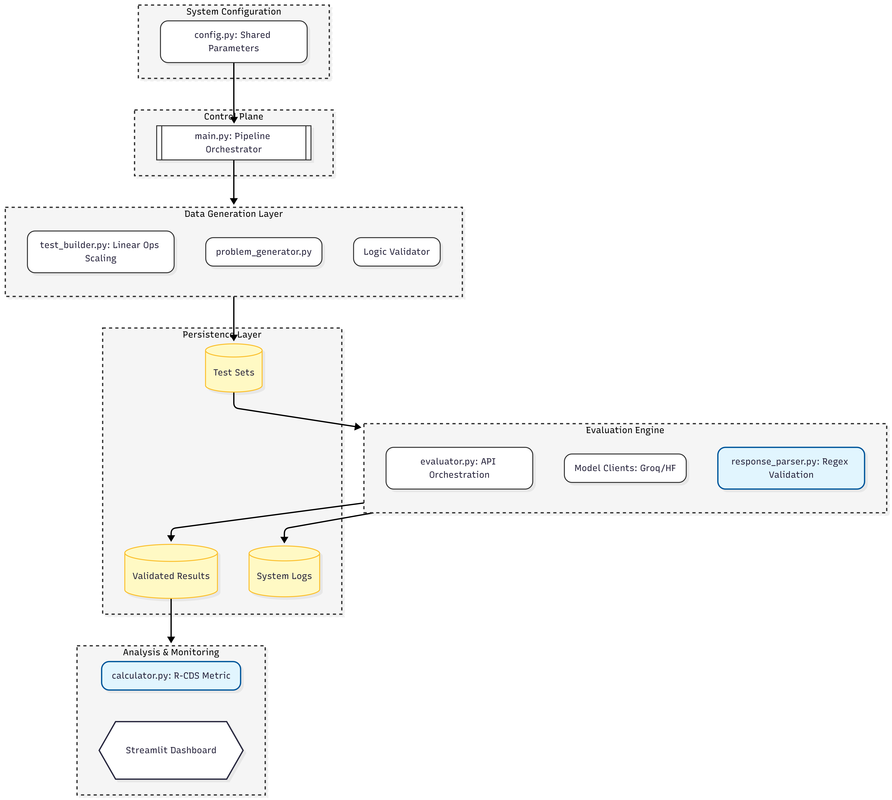

# Reasoning Authentication Framework (RAF)
### A Stratified Complexity Framework for Evaluating Compositional Reasoning in LLMs

RAF is a software framework developed to **operationally evaluate compositional reasoning behavior in Large Language Models (LLMs)** under controlled complexity scaling. The framework is designed to distinguish between **cognitive failure** (reasoning degradation under task complexity) and **system failure** (artifacts arising from infrastructure limits such as token truncation or parsing errors).

Rather than making claims about internal cognition, RAF focuses on **observable, reproducible behavioral signals** obtained through carefully structured evaluation pipelines.

---

## 🏗️ System Architecture (v3.0)

RAF follows a decoupled, artifact-aware pipeline architecture to isolate reasoning variables and ensure measurement fidelity.

- **Problem Generator (`test_builder.py`)**  
  Generates arithmetic reasoning tasks with **linear operation scaling**, ensuring monotonic and fine-grained complexity growth.

- **Evaluator (`evaluator.py`)**  
  Orchestrates API calls across multiple model families with structured logging and failure handling.

- **Parser & Judge (`response_parser.py`)**  
  Applies Regex-based validation to separate malformed or truncated outputs from logically incorrect reasoning.

- **Metrics Calculator (`calculator.py`)**  
  Computes **R-CDS (Robust Compositional Decay Score)** to capture non-linear performance collapses across complexity levels.

- **Monitoring Layer**  
  A lightweight **Streamlit dashboard** visualizes accuracy trends and decay behavior in real time.

---

## 🏛️ Architecture Evolution

| Feature | Phase I & II (Diagnostic Scripts) | Phase III / v3.0 (Framework) |
| :--- | :--- | :--- |
| Logic Structure | Monolithic evaluation flow | Decoupled generator, evaluator, and analysis |
| Complexity Unit | Nesting depth | Linear operation count |
| Error Handling | Mixed logic & system failures | Artifact-aware parsing separation |
| Primary Metric | CDS (aggregate decay) | R-CDS (shape-aware decay) |
| Persistence | Console logs | Structured JSONL artifacts |

---

## 📈 Framework Evolution

RAF evolved through three iterative phases focused on reducing experimental noise and improving interpretability.

| Feature | Phase I | Phase II | Phase III |
| :--- | :--- | :--- | :--- |
| Complexity Control | Nesting depth (0–10) | Reduced depth (0–5) | Linear ops (1–29) |
| Scaling Behavior | Non-monotonic jumps | Stabilized depth | Monotonic increments |
| Evaluation Metric | CDS | CDS | R-CDS |
| System Stability | Low | Medium | High |
| Model Scope | Single model | Single model | Multi-model |

### Key Methodological Shifts

1. **Depth → Operations**  
   Nesting depth introduced hidden non-linear operation growth. Linear ops enabled finer and more interpretable scaling.

2. **Infrastructure Isolation**  
   Failures beyond certain depths were often attributable to serving-layer constraints rather than reasoning limits, motivating explicit artifact separation.

3. **Shape-Aware Evaluation**  
   R-CDS was introduced to penalize sharp accuracy collapses that aggregate metrics fail to capture.

---

## 📊 Benchmarking & Results

### Robust Compositional Decay Score (R-CDS)

R-CDS combines overall performance with sensitivity to sudden degradation:

$$RCDS = AUC \times (1 - D_{max})$$

where:
- **AUC** represents accuracy over increasing complexity
- **$$D_{max}$$** is the maximum drop between consecutive complexity levels

### Illustrative Multi-Model Comparison (Phase III)

| Model | Ops Range | Accuracy Trend | Max Drop | R-CDS |
| :--- | :--- | :--- | :--- | :--- |
| ChatGPT-OSS 120B | 1–19 | Stable plateau | 0.05 | 0.95 |
| ChatGPT-OSS 20B | 1–19 | Near-perfect plateau | 0.00 | 1.00 |
| LLaMA 3.1 8B | 1–29 | Gradual decay, sharp cliff | 0.30 | 0.70 |

> Results are intended to demonstrate **measurement behavior**, not to serve as a definitive leaderboard.

---

## 🎯 Conclusion

RAF demonstrates that careful system design and artifact-aware evaluation can reveal **structured reasoning degradation patterns** that are otherwise obscured by infrastructure noise. The framework emphasizes:

- **Behavioral evaluation** of reasoning under controlled complexity
- **Separation of system artifacts from logical failures**
- **Shape-aware metrics** for identifying non-linear performance collapse
- **Scalable benchmarking infrastructure** across model sizes

RAF is positioned as a **measurement framework**, not a claim about internal model cognition.

---

## 🔭 Future Work

- Extend **Information-Constrained Compositional Reasoning (ICCR)** tasks as downstream benchmarks built on RAF.
- Introduce tighter information budgets and constrained query interfaces.
- Analyze query traces as first-class evaluation artifacts.
- Study robustness of planning behavior across model scales.
- Open-source task generators and evaluators for reproducible research.

---

**Institution:** Indian Institute of Information Technology Guwahati (IIITG)  
**Author:** Hillol Pratim Kalita  
**Advisor:** Prof. Ferdous A. Barbhuiya  
**Date:** December 2025
