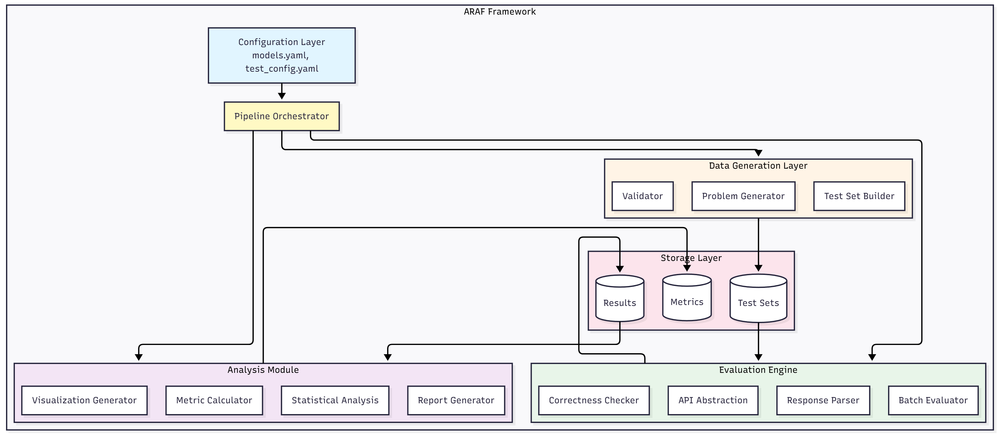
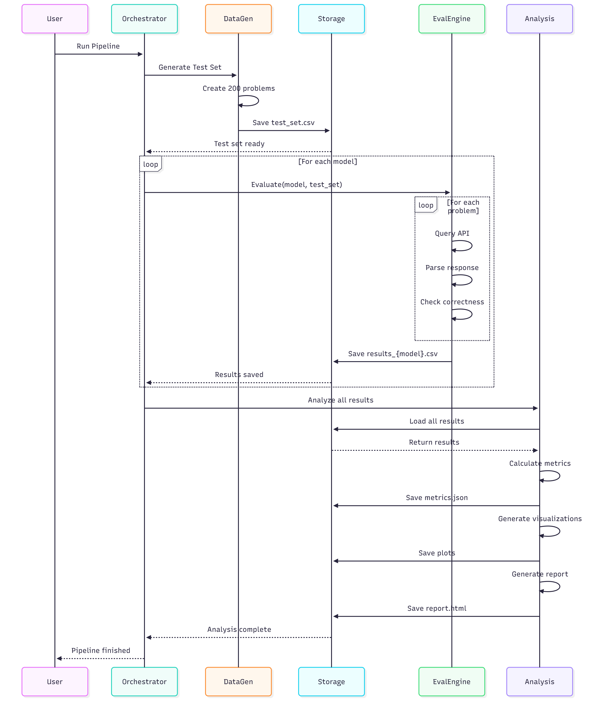

# ReasoningAuthenticationFramework-RAF

## Stratified Complexity Benchmark

A diagnostic tool part of a larger evaluation framework to test whether language models perform genuine compositional reasoning or rely on pattern matching.

## How It Works

The benchmark generates arithmetic problems with increasing nested complexity (Level 0 to Level 10) and measures how model accuracy degrades:

- **Reasoning models** → Smooth, gradual performance decay
- **Pattern-matching models** → Sudden accuracy collapse (cliff)

## System Design

### Architecture


The pipeline generates stratified problems, queries the model via API, parses responses, and calculates the Compositional Decay Score (CDS).

### Sequence Flow


End-to-end flow from benchmark generation through evaluation and analysis.

## Quick Start

```bash
pip install -r requirements.txt
export HF_TOKEN="your_token_here"
python benchmark.py --levels 10 --problems-per-level 3
```

## Results

**Llama 3 8B Instruct** exhibits pattern matching behavior:
- Sharp accuracy cliff at Level 3-4 (100% → 0%)
- CDS: 0.83-0.90
- Logs have not been incuded due to size concerns(verbosity) during git push
---
**Institution:** IIIT-G 
**Author:** Hillol P. Kalita  
**Supervisor:** Prof. Ferdous A. Barbhuiya
